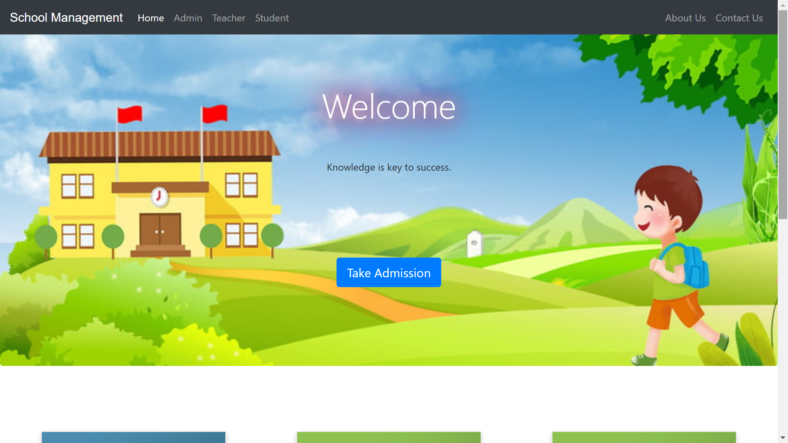
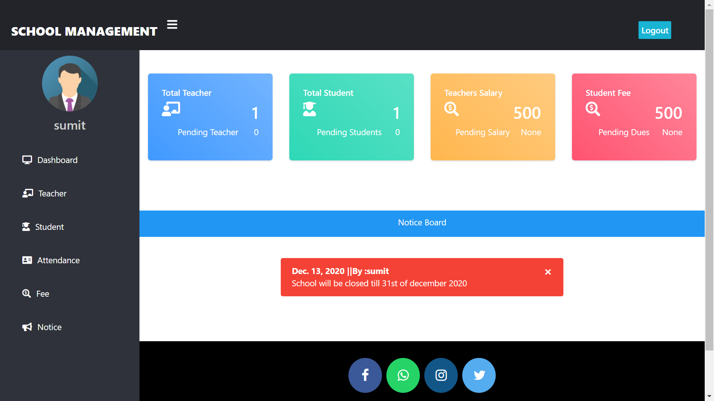
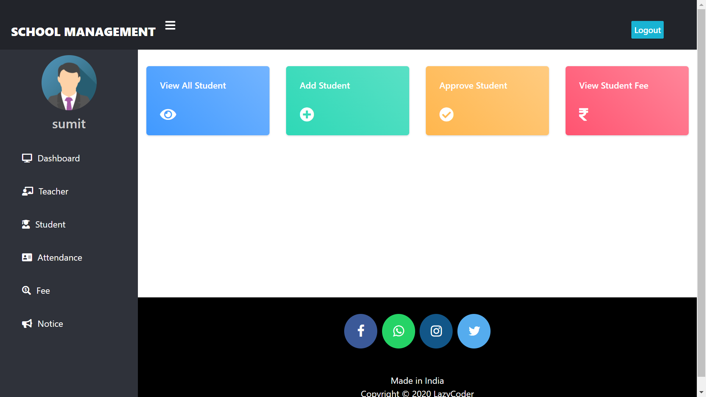
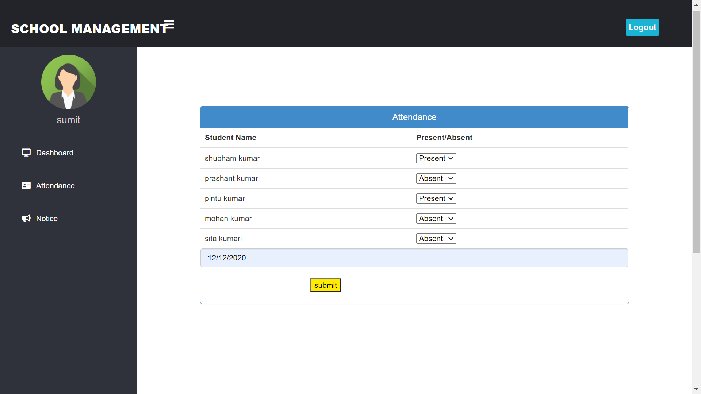
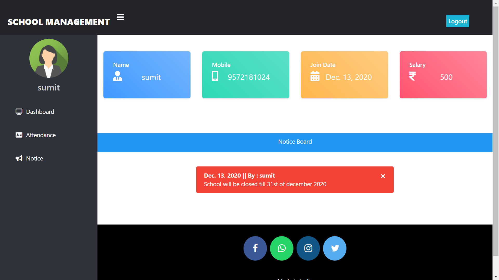

# 🏫 School Management System

A web-based School Management System developed using **Python, Django, SQLite, HTML, CSS, and Bootstrap**. The application provides separate modules for **Admin, Teacher, and Student** to efficiently manage school activities.

## 🚀 Features

### 👨‍💼 Admin
- Admin Login
- Approve/Reject Teacher Accounts
- Approve/Reject Student Admissions
- Manage Teachers
- Manage Students
- Manage Attendance
- Publish Notices

### 👨‍🏫 Teacher
- Teacher Registration & Login
- Take Student Attendance
- View Attendance Records
- Publish Notices

### 👨‍🎓 Student
- Student Registration & Login
- View Attendance
- View Notices
- Update Profile

---

## 🛠️ Technologies Used

- Python
- Django
- SQLite
- HTML
- CSS
- Bootstrap

---

## 📷 Screenshots

### Homepage


### Admin Dashboard


### Manage Teachers


### Attendance


### Teacher Dashboard


---

## ⚙️ Installation

```bash
git clone https://github.com/madhusalini4150/School-Management-System.git

cd School-Management-System

python -m venv venv

venv\Scripts\activate

pip install -r requirements.txt

python manage.py migrate

python manage.py runserver
```

Open your browser and visit:

```
http://127.0.0.1:8000/
```

---

## 📚 Project Type

This project was completed as part of a **Full Stack Python Internship** for learning and academic purposes.

---

## 👩‍💻 Author

**Madhu Salini**

GitHub: https://github.com/madhusalini4150

---

## 📄 License

This project is licensed under the MIT License.
